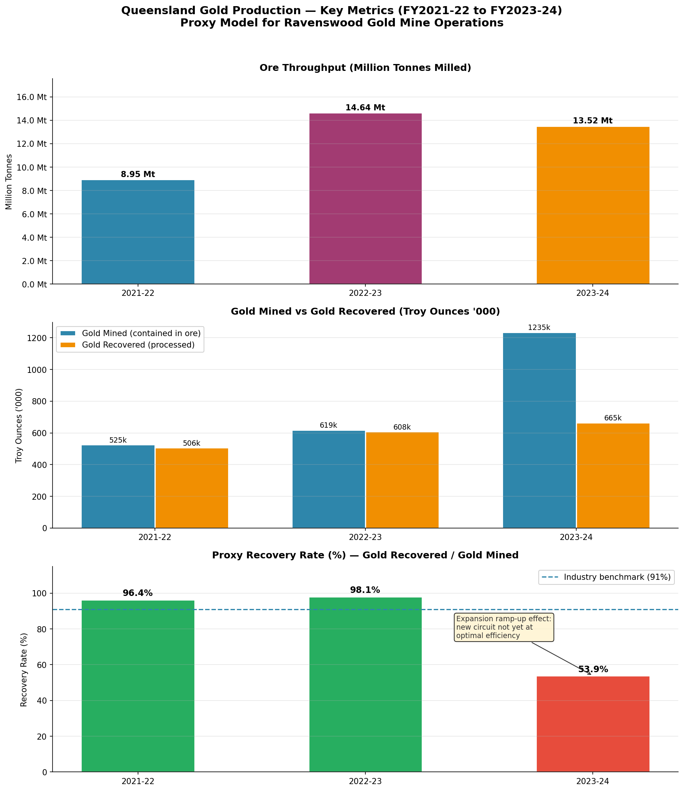
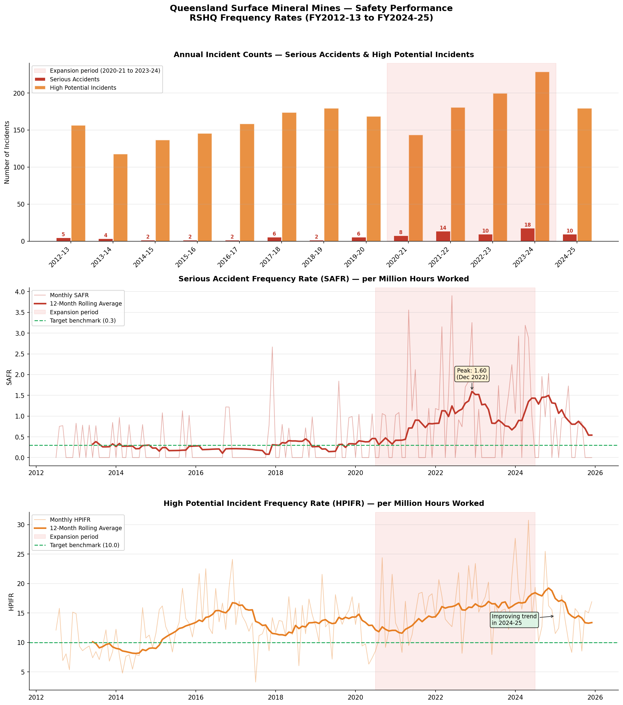
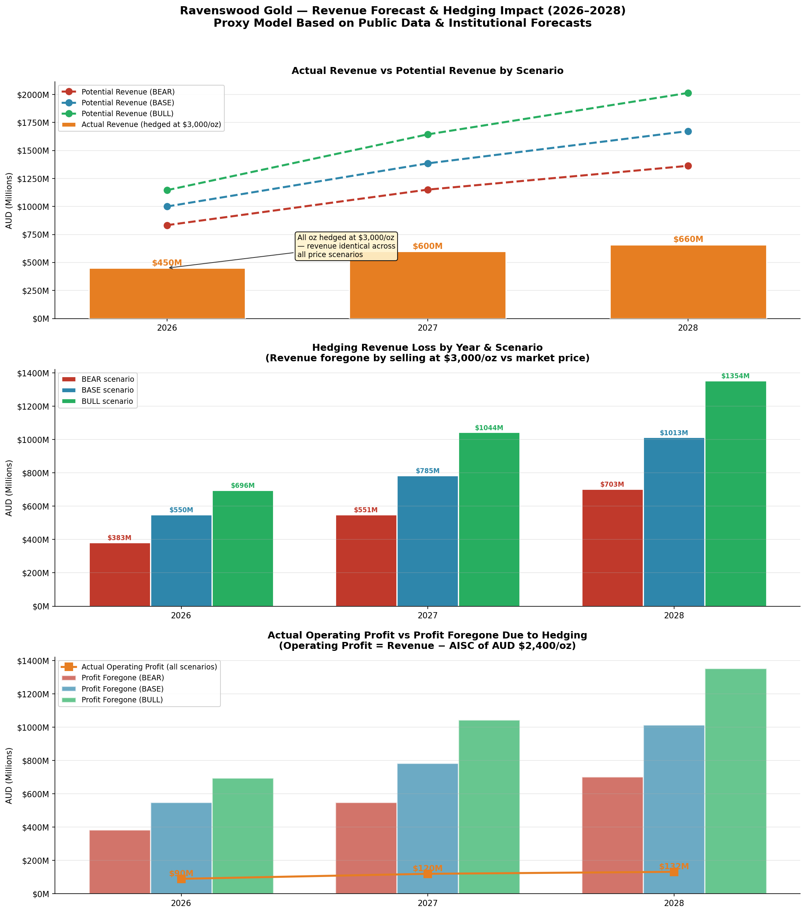
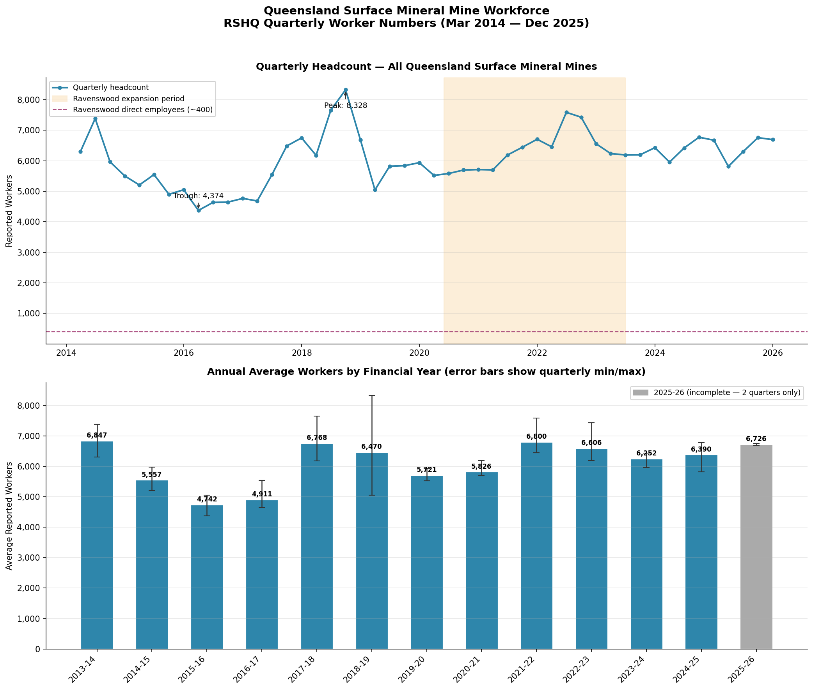
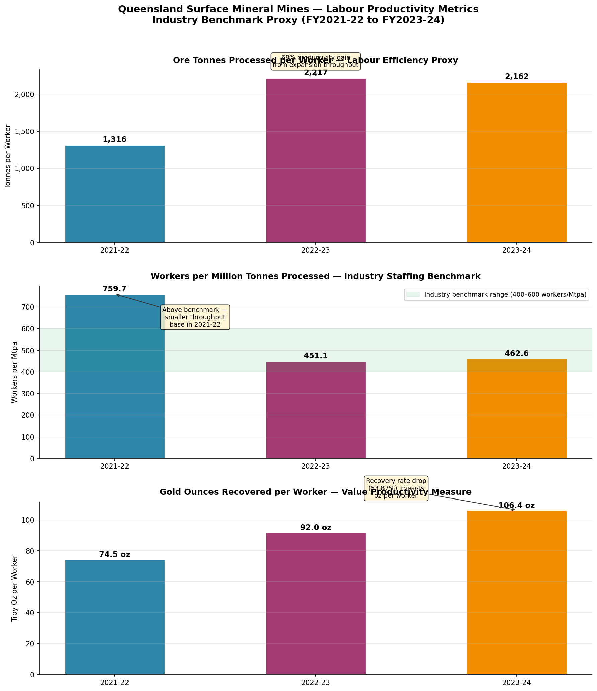
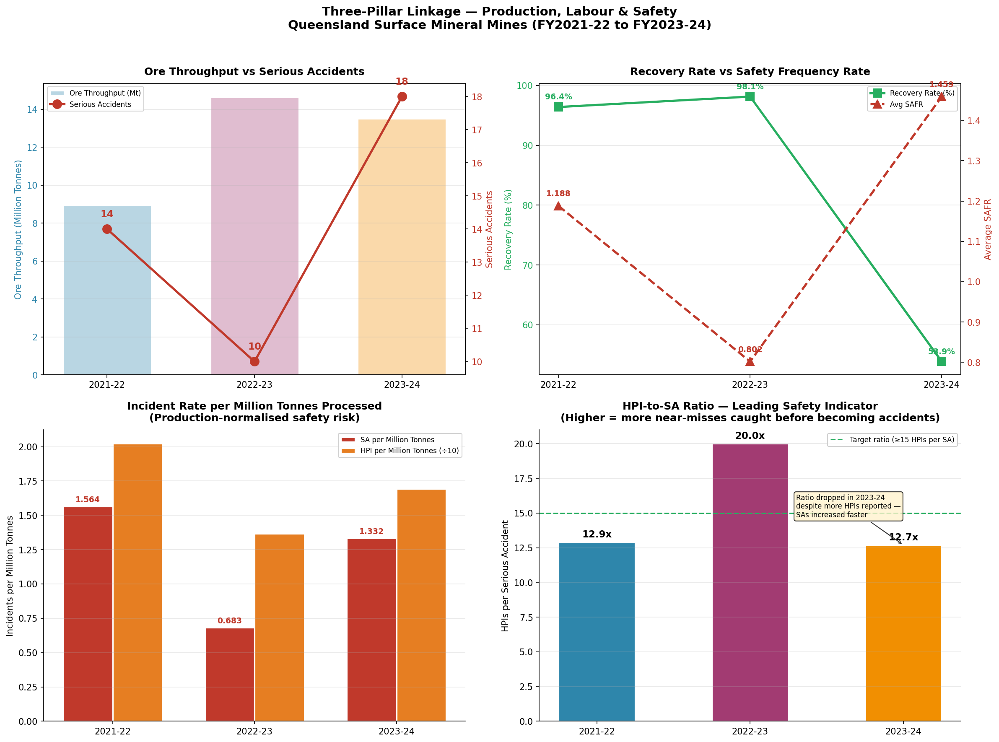
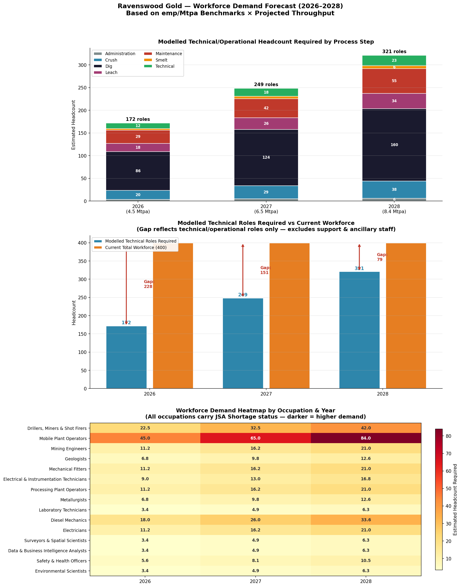
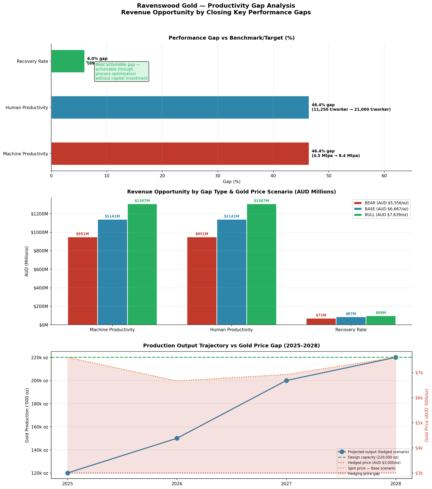
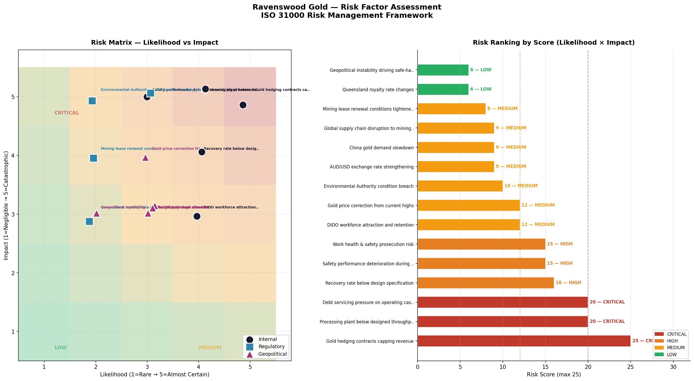

# Ravenswood Gold Mine — Operations Proxy Model
### A Three-Pillar Business Intelligence Framework for Queensland's Largest Gold Producer

**Author:** Erick Mortera — Certified Lean Manufacturing Trainer | Industrial Engineer | Business Intelligence Analyst  
**Tools:** Python · MySQL · Power BI · Queensland Government Open Data · RSHQ Safety Data · ABS Labour Statistics  
**Status:** Analysis complete

---

## Executive Summary

This is an independent case study using publicly available Australian government data to approximate the operational performance of Ravenswood Gold Mine — Queensland's largest gold producer, located 130km south of Townsville and jointly owned by EMR Capital and Golden Energy and Resources (GEAR).

Ravenswood completed a AUD $350 million expansion between 2020 and 2024, scaling ore processing capacity from 2.5 million tonnes per annum (Mtpa) to a designed capacity of 8.4 Mtpa. As at May 2026, the mine is ramping up to its 200,000 oz annual production target while navigating a critical AUD $650 million refinancing deadline — a situation described by the Australian Financial Review as approaching insolvency risk prior to the RRJ Capital loan agreement.

This proxy model demonstrates that three operational pillars — Production, Labour, and Safety — are deeply interconnected, and that data-driven integration of these pillars is the foundational capability required to stabilise and optimise operations through the ramp-up phase.

**Three headline findings from publicly available data:**

| Finding | Metric | Source |
|---|---|---|
| Processing plant operating at 54% of designed capacity | 4.5 Mtpa actual vs 8.4 Mtpa target | Ravenswood Gold public statements |
| Safety performance deteriorated sharply during expansion | 18 serious accidents in 2023-24 vs 6 in 2019-20 | RSHQ Quarterly Safety Data |
| Hedging contracts lock in AUD $550M profit foregone in 2026 alone | AUD $3,000/oz hedged vs AUD $6,667/oz spot (base scenario) | AFR / J.P. Morgan Gold Forecast |

> **Scope disclaimer:** This model is built entirely from publicly available Queensland government datasets, Australian Bureau of Statistics labour data, and published institutional forecasts. No proprietary or confidential Ravenswood Gold data has been accessed or used. All site-level figures are proxy estimates anchored to publicly stated operational targets. This study is conducted independently and is not affiliated with Ravenswood Gold, EMR Capital, or Golden Energy and Resources.

---

## Why This Framework?

Most mining operational analyses ask: *how much gold was produced?*

This study asks: *what is preventing the mine from reaching its designed capacity, who bears the cost of each performance gap, and what data infrastructure is needed to close those gaps?*

The three-pillar framework was designed to reflect how production, labour, and safety interact in a real mining operation — and to demonstrate that meaningful operational insight requires all three to be modelled together, not in isolation.

| Analytical Pillar | Core Question | Key Metric |
|---|---|---|
| Production | Is the plant operating at designed capacity? | Recovery rate, ore throughput |
| Labour | Does the workforce have the skills to sustain the ramp-up? | Tonnes/worker, shortage risk by occupation |
| Safety | Is safety performance keeping pace with production growth? | SAFR, HPIFR, HPI-to-SA ratio |
| Cross-pillar | What does integrated data reveal that individual pillars cannot? | Safety-production linkage, workforce demand forecast |

---

## The Gold Mining Process — Context for Non-Mining Readers

Understanding the data requires understanding the production process. Ravenswood operates two open cut pits and a Carbon-In-Pulp (CIP) processing circuit:

```
Open Cut Pits (Dig)
    ↓
Primary Crusher → SAG Mill → Ball Mill (Crush & Grind)
    ↓
CIP Leaching Circuit — cyanide dissolves gold from slurry (Leach)
    ↓
Carbon Stripping → Electrowinning → Smelting → Doré Bar (Smelt)
    ↓
Refinery (off-site) → 99.99% Pure Gold Bullion
```

**Key terms used throughout this study:**

| Term | Definition |
|---|---|
| **Ore throughput (Mtpa)** | Tonnes of rock crushed and processed per annum — the core production KPI |
| **Head grade (g/t)** | Grams of gold per tonne of ore — determines how much gold is theoretically available |
| **Recovery rate (%)** | Percentage of gold in ore actually captured in the final doré — CIP circuit efficiency |
| **Doré** | Semi-pure gold-silver alloy bar (~90% gold) produced on site — the mine's finished product |
| **Troy ounce** | Unit of precious metal measurement — 1 troy oz = 31.1 grams |
| **AISC** | All-In Sustaining Cost — true cost per ounce including mining, processing, admin and sustaining capital |
| **DIDO** | Drive-In Drive-Out — roster arrangement for remote site workers based in nearby towns |
| **SAFR** | Serious Accident Frequency Rate — serious accidents per million hours worked |
| **HPIFR** | High Potential Incident Frequency Rate — near-misses per million hours worked |
| **HPI-to-SA ratio** | HPIs per serious accident — leading safety indicator; higher ratio means more near-misses caught before becoming accidents |

---

## Data Sources

All primary data is Australian public domain:

| Source | What It Provides | Period | Licence |
|---|---|---|---|
| [Qld Dept of Resources — Mineral Production Statistics](https://www.data.qld.gov.au) | Gold ore throughput, doré output, contained metals mined and processed | FY2021-22 to FY2023-24 | CC BY 4.0 |
| [RSHQ — Quarterly Mine & Quarry Safety Data](https://www.data.qld.gov.au/dataset/quarterly-mines-and-quarries-safety-statistics-data) | Incident frequency rates (SAFR, HPIFR), monthly serious accidents, HPIs | Jul 2012 — Dec 2025 | CC BY 4.0 |
| [RSHQ — Quarterly Worker Numbers](https://www.data.qld.gov.au/dataset/quarterly-mines-and-quarries-safety-statistics-data) | Queensland surface mineral mine headcounts by quarter | Mar 2014 — Dec 2025 | CC BY 4.0 |
| [ABS — Labour Force Survey Detailed](https://www.abs.gov.au/statistics/industry/mining) | National mining employment by sub-sector, earnings | FY2015 — FY2025 | CC BY 4.0 |
| [Jobs & Skills Australia — Occupation Shortage List](https://www.jobsandskills.gov.au/data/occupation-shortage-list) | Shortage status by occupation 2021-2025 | 2021 — 2025 | CC BY 4.0 |
| [Jobs & Skills Australia — Employment Projections](https://www.jobsandskills.gov.au/data/employment-projections) | Mining employment projections to 2034 (Victoria University model) | 2024 — 2034 | CC BY 4.0 |
| [J.P. Morgan Global Research](https://www.jpmorgan.com/insights/global-research/commodities/gold-prices) | Gold price forecasts 2026-2027 | 2026 — 2027 | Public |
| [Ravenswood Gold — Public Statements](https://statements.qld.gov.au/statements/99875) | Production targets, headcount, expansion details | 2024 — 2026 | Public |
| [AFR / Industry Queensland](https://industryqld.com.au) | Hedging obligations, refinancing deadline, oz/month production | 2025 — 2026 | Public |

---

## Three-Pillar Framework

```
Production (Core)
├── Labour (Supporting) — workforce size drives throughput capacity
├── Safety (Supporting) — incident rates drive downtime and compliance cost
└── Cross-Pillar Linkage — all three connected through financial year in MySQL
```

---

## Pillar 1 — Production

**What was modelled:**
- Ore throughput (tonnes milled) — Queensland gold sector total, used as industry benchmark
- Doré output (tonnes) — processed gold product volume
- Contained gold mined (troy oz) — theoretical gold available in ore
- Contained gold recovered (troy oz) — gold actually captured after CIP processing
- Proxy recovery rate — recovered oz ÷ mined oz × 100

**Key finding:**

| Financial Year | Ore Throughput | Recovery Rate | Context |
|---|---|---|---|
| 2021-22 | 8.95 Mt | 96.40% | Pre-expansion baseline |
| 2022-23 | 14.64 Mt | 98.14% | Expansion ramp-up peak |
| 2023-24 | 13.52 Mt | 53.87% | New circuit commissioning — recovery gap |

The 2023-24 recovery rate collapse (53.87%) directly reflects the expansion ramp-up period — new leaching tanks and ball mill processing more ore than the circuit could yet efficiently recover. This is the most actionable finding for process optimisation.



---

## Pillar 2 — Labour

**What was modelled:**
- Quarterly Queensland surface mineral mine worker headcounts (48 quarters, 2014-2025)
- Annual average, minimum and maximum headcounts by financial year
- Labour productivity: tonnes per worker, workers per Mtpa, gold oz per worker
- Workforce demand forecast by process step to 2028 (emp/Mtpa × projected throughput)
- Skills shortage risk by occupation (JSA Occupation Shortage List overlay)

**Key finding — productivity trend:**

| Financial Year | Avg Workers | Tonnes/Worker | Workers/Mtpa | Gold Oz/Worker |
|---|---|---|---|---|
| 2021-22 | 6,800 | 1,316 | 759.7 | 74.5 |
| 2022-23 | 6,606 | 2,217 | 451.1 | 92.0 |
| 2023-24 | 6,252 | 2,162 | 462.6 | 106.4 |

**Key finding — workforce demand forecast:**

| Year | Throughput | Technical Roles Required | Current Workforce | High-Risk Roles |
|---|---|---|---|---|
| 2026 | 4.5 Mtpa | 172 | 400 | 15/15 |
| 2027 | 6.5 Mtpa | 249 | 400 | 15/15 |
| 2028 | 8.4 Mtpa | 321 | 400 | 15/15 |

All 15 modelled technical occupations carry JSA Shortage status as at 2025 — every role required to operate the mine at designed capacity is classified as a national skills shortage.

---

## Pillar 3 — Safety

**What was modelled:**
- Monthly SAFR and HPIFR (162 months, July 2012 — December 2025)
- Annual serious accident and HPI counts
- 3-month and 12-month rolling average frequency rates
- Production-normalised safety risk (incidents per million tonnes)
- HPI-to-SA ratio as a leading safety indicator
- Benchmarking against Queensland surface mineral mine industry average

**Key finding — safety deteriorated during expansion:**

| Financial Year | Serious Accidents | HPIs | SAFR | SA per Million Tonnes | HPI:SA Ratio |
|---|---|---|---|---|---|
| 2021-22 | 14 | 181 | 1.188 | 1.564 | 12.9x |
| 2022-23 | 10 | 200 | 0.802 | 0.683 | 20.0x |
| 2023-24 | 18 | 229 | 1.459 | 1.332 | 12.7x |

The HPI-to-SA ratio drop from 20.0x in 2022-23 to 12.7x in 2023-24 is a critical leading indicator — more near-misses occurred but serious accidents increased faster, suggesting that HPI reporting culture weakened under expansion pressure precisely when it was most needed.



---

## Proxy Revenue Model

### Assumption Inputs

| Parameter | Value | Source |
|---|---|---|
| Hedged gold price | AUD $3,000/oz | AFR reporting on Ravenswood hedging obligations |
| Hedged volume | 220,000 oz | AFR / Industry Queensland |
| Current spot gold (May 2026) | ~AUD $6,500/oz | Live market data |
| AUD/USD 2026 | 0.72 | ExchangeRates.org.uk / RBA |
| AISC estimate | AUD $2,400/oz | World Gold Council / PwC Mine 2024 / S&P Global |

### Gold Price Scenarios (USD/oz → AUD/oz)

| Scenario | 2026 USD | 2026 AUD | 2027 AUD | 2028 AUD | Source |
|---|---|---|---|---|---|
| Bear | $4,000 | $5,556 | $5,753 | $6,197 | Macquarie Group / EBC Financial |
| Base | $4,800 | $6,667 | $6,925 | $7,606 | J.P. Morgan Q4 2026-2027 forecast |
| Bull | $5,500 | $7,639 | $8,219 | $9,155 | Wells Fargo / BNP Paribas upper range |

### Revenue Forecast (AUD Millions)

| Year | Production Target | Actual Revenue (hedged) | Potential Revenue (base) | Profit Foregone (base) | Operating Profit |
|---|---|---|---|---|---|
| 2026 | 150,000 oz | $450M | $1,000M | $550M | $90M |
| 2027 | 200,000 oz | $600M | $1,385M | $785M | $120M |
| 2028 | 220,000 oz | $660M | $1,673M | $1,013M | $132M |

**Critical insight:** Because 100% of production is hedged through 2028, actual revenue and operating profit are identical across all three gold price scenarios. The gold price scenario makes zero difference to Ravenswood's actual income until hedges expire. This is the core financial constraint driving the refinancing crisis.



---

## Productivity Gap Analysis

Ravenswood-specific proxy inputs anchored to publicly stated figures:

| Gap Type | Actual | Benchmark | Gap | Revenue Opportunity (Base) |
|---|---|---|---|---|
| Machine productivity | 4.5 Mtpa | 8.4 Mtpa | 3.9 Mtpa (46.4%) | AUD $1,141M |
| Human productivity | 11,250 t/worker | 21,000 t/worker | 9,750 t/worker (46.4%) | AUD $1,141M |
| Recovery rate | 85.0% | 91.0% | 6.0% | AUD $86.8M |

> **Note on machine and human gaps:** Both gaps are driven by the same underlying constraint — throughput below designed capacity. They represent the same shortfall viewed from two angles and cannot be treated as independent opportunities. The recovery rate gap (AUD $86.8M) is the most immediately actionable — achievable through process data optimisation without additional capital investment.

---

## Risk Assessment

**Methodology:** ISO 31000 Risk Management Framework  
**Scoring:** Likelihood (1-5) × Impact (1-5) = Risk Score (max 25)

| Risk | Category | L | I | Score | Level |
|---|---|---|---|---|---|
| Gold hedging contracts capping revenue | Internal | 5 | 5 | 25 | CRITICAL |
| Processing plant below designed throughput | Internal | 4 | 5 | 20 | CRITICAL |
| Debt servicing pressure on operating cashflow | Internal | 4 | 5 | 20 | CRITICAL |
| Recovery rate below design specification | Internal | 4 | 4 | 16 | HIGH |
| Safety performance deterioration during expansion | Internal | 3 | 5 | 15 | HIGH |
| Work health & safety prosecution risk | Regulatory | 3 | 5 | 15 | HIGH |
| DIDO workforce attraction and retention | Internal | 4 | 3 | 12 | MEDIUM |
| Environmental Authority condition breach | Regulatory | 2 | 5 | 10 | MEDIUM |
| Gold price correction from current highs | Geopolitical | 3 | 4 | 12 | MEDIUM |
| AUD/USD exchange rate strengthening | Geopolitical | 3 | 3 | 9 | MEDIUM |
| China gold demand slowdown | Geopolitical | 3 | 3 | 9 | MEDIUM |
| Global supply chain disruption to mining inputs | Geopolitical | 3 | 3 | 9 | MEDIUM |
| Mining lease renewal conditions tightened | Regulatory | 2 | 4 | 8 | MEDIUM |
| Queensland royalty rate changes | Regulatory | 2 | 3 | 6 | LOW |
| Geopolitical instability driving safe-haven demand reversal | Geopolitical | 2 | 3 | 6 | LOW |

**Risk summary: 3 Critical · 3 High · 7 Medium · 2 Low**

All three critical risks are internal — meaning they are within management's ability to influence through better operational data, faster decision-making, and improved process performance.

---

## Dashboard

 ## Dashboard

📊 **Power BI Dashboard (PDF Export)** — [View Dashboard](output/Ravenswood_Operations_Dashboard.pdf)  
🔗 **Interactive Power BI Dashboard** — Not publicly hosted. Power BI Service requires a work or school Microsoft account for web publishing. The `.pbix` file is available in the `dashboard/` folder for download and local viewing in Power BI Desktop (free).
🔗 **Web Dashboard (public access)** — Coming soon (React — in development)

The Power BI report connects directly to the MySQL `ravenswood_operations` database across four pages:
- **Executive Overview** — SCDP KPIs (Safety, Cost, Delivery, Productivity) + revenue forecast + safety trend
- **Production** — Ore throughput, doré output, recovery rate, productivity gap table
- **Labour & Workforce** — Quarterly headcount trend, productivity metrics, skills demand forecast
- **Safety** — SAFR/HPIFR trends, incident counts, HPI-to-SA ratio, benchmarking table

The `.pbix` file is available in the `dashboard/` folder for download and local use with Power BI Desktop (free).
🔗 **Web Dashboard (public access)** — Coming soon

The dashboard layer connects directly to the MySQL database and presents the three-pillar framework as an interactive operational monitoring tool. Both a Power BI report (for internal/desktop use) and a web-based dashboard (for public portfolio access) are currently in development.

---

## Additional Charts

<details>
<summary>Click to expand — all output charts</summary>

### Chart 02 — Queensland Surface Mineral Mine Workforce Trend


### Chart 03 — Labour Productivity Metrics


### Chart 05 — Three-Pillar Safety-Production Linkage


### Chart 07 — Workforce Demand Forecast by Process Step


### Chart 08 — Productivity Gap Analysis


### Chart 09 — Risk Matrix


</details>

---

## Database Architecture

A MySQL relational database underpins all analysis — `ravenswood_operations`.  
8 tables, 3 operational pillars, 1 proxy model layer.

| Table | Rows | Purpose |
|---|---|---|
| `ref_financial_years` | 14 | Primary key anchor — financial year lookup with expansion period flag |
| `ref_skill_shortages` | 15 | JSA occupation shortage status + emp/Mtpa benchmarks by process step |
| `production_summary` | 3 | Ore throughput, doré, gold mined/recovered, recovery rate |
| `labour_quarterly` | 48 | Quarterly Queensland surface mineral mine headcounts 2014-2025 |
| `labour_production_linked` | 3 | Annual productivity metrics — tonnes/worker, workers/Mtpa, oz/worker |
| `safety_monthly` | 162 | Monthly SAFR, HPIFR, serious accidents, HPIs, hours worked |
| `safety_annual` | 14 | Annual safety KPIs with 12-month rolling benchmark rates |
| `safety_production_linked` | 14 | Cross-pillar — incidents per million tonnes, HPI-to-SA ratio |

---

## Repository Structure

```
Ravenswood-Operations-Proxy-Model/
├── README.md
├── .gitignore
├── requirements.txt
├── download_data.py
├── data/
│   ├── raw/                          ← source files (not committed)
│   └── processed/
│       ├── production/
│       │   └── gold_production_qld.csv
│       ├── labour/
│       │   ├── qld_surface_mineral_workers_quarterly.csv
│       │   └── labour_production_linked.csv
│       ├── safety/
│       │   ├── safety_monthly.csv
│       │   ├── safety_annual.csv
│       │   └── safety_production_linked.csv
│       ├── revenue_forecast.csv
│       ├── workforce_demand_forecast.csv
│       ├── productivity_gap_analysis.csv
│       └── risk_assessment.csv
├── notebooks/
│   ├── 01_production_ingestion.ipynb
│   ├── 02_labour_ingestion.ipynb
│   ├── 03_safety_ingestion.ipynb
│   ├── 04_database_load.ipynb
│   └── 05_proxy_model.ipynb
├── src/
├── output/
│   ├── 01_production_metrics.png
│   ├── 02_labour_workforce_trend.png
│   ├── 03_labour_productivity.png
│   ├── 04_safety_trends.png
│   ├── 05_safety_production_linkage.png
│   ├── 06_revenue_forecast.png
│   ├── 07_workforce_demand.png
│   ├── 08_productivity_gaps.png
│   └── 09_risk_matrix.png
└── dashboard/                        ← Power BI + web dashboard (in development)
```

---

## Methodology and Key Assumptions

### Production Data Scope
Queensland mineral production statistics cover all gold mining operations across the state. Ravenswood is the largest single surface mineral gold producer in Queensland but the data is not disaggregated by mine site in public releases. Queensland-wide figures are used as industry benchmarks; Ravenswood-specific proxy figures in the revenue and productivity models are anchored to publicly stated operational targets.

### Unit Normalisation
The Queensland mineral production dataset contains mixed units across sheets — some quantities in plain Troy Ounces, others in Troy Ounces ('000). All figures were normalised to plain Troy Ounces before aggregation. This is a documented data quality issue in the source files, reflecting that different Queensland mining operations report at different scales.

### Recovery Rate Interpretation
The proxy recovery rate (gold recovered oz ÷ gold mined oz) is influenced by the data description caveat that processed quantities may include feedstock sourced from outside Queensland. The 2023-24 figure of 53.87% reflects both the expansion ramp-up effect and this inter-state feedstock dynamic. It is used as a directional indicator rather than a precise operational figure.

### Workforce Model Scope
The emp/Mtpa workforce demand model covers 15 key technical and operational occupations drawn from the JSA Occupation Shortage List. The full Ravenswood workforce of ~400 direct employees includes additional support, administrative, and ancillary roles not captured in the model. The model produces an estimate of technically-skilled headcount demand, not total site headcount.

### Gold Price Conversion

| Year | USD/oz (Base) | AUD/USD | AUD/oz (Base) | Source |
|---|---|---|---|---|
| 2026 | $4,800 | 0.72 | $6,667 | J.P. Morgan / ExchangeRates.org.uk |
| 2027 | $5,055 | 0.73 | $6,925 | J.P. Morgan / CoinCodex |
| 2028 | $5,400 | 0.71 | $7,606 | LongForecast / Traders Union |

*Sources: J.P. Morgan Global Research Gold Forecast (jpmorgan.com/insights);  
ExchangeRates.org.uk AUD/USD quarterly forecast;  
CoinCodex AUD/USD 2026-2028 projection;  
Reserve Bank of Australia exchange rate data*

### AISC Assumption
The All-In Sustaining Cost estimate of AUD $2,400/oz is derived from:
- World Gold Council global average AISC of USD $1,350/oz (2023), converted at 0.72
- S&P Global Mine Cost Outlook 2026 — above-average cost expectation for ramp-up phase
- PwC Mine 2024 — post-pandemic cost inflation of 15-20% on global average

### Hedged Price Assumption
A single blended hedged price of AUD $3,000/oz is applied to all hedged ounces (220,000 oz). This simplification is based on AFR and Industry Queensland reporting that Ravenswood's hedging contracts were struck at significantly below market rates. The actual hedging structure likely comprises multiple tranches at varying prices — a single blended figure is used here for transparency and reproducibility.

### Sensitivity Analysis

| Scenario | 2026 AUD Gold | Actual Revenue | Potential Revenue | Profit Foregone |
|---|---|---|---|---|
| Bear | $5,556/oz | $450M | $833M | $383M |
| Base | $6,667/oz | $450M | $1,000M | $550M |
| Bull | $7,639/oz | $450M | $1,146M | $696M |

Note: Actual revenue is identical across all scenarios because 100% of 2026 production is hedged. Scenario analysis matters only for post-hedging revenue planning from 2029 onwards.

---

## Key Analytical Decisions

**Why use Queensland-wide data rather than Ravenswood-specific data?**  
Ravenswood Gold is a private company and does not publish site-level operational data. Queensland government datasets provide the best available public proxy for surface mineral mine performance in the region. Ravenswood-specific figures are used only where they are publicly stated.

**Why connect safety to production in the same framework?**  
Production, labour, and safety are operationally inseparable in a mine environment. A serious accident triggers downtime, regulatory intervention, and workforce disruption — all of which directly affect throughput. The three-pillar linkage demonstrates that the 2023-24 safety deterioration (18 serious accidents) coincided with the production ramp-up stress (recovery rate collapse to 53.87%) — an insight that is only visible when the pillars are analysed together.

**Why include the revenue and risk models?**  
Revenue forecasting and risk assessment are standard strategic deliverables in a mining business improvement context. Including them demonstrates that the analytical framework can support strategic decision-making, not just operational reporting.

---

## Citation

> Mortera, E. (2026). *Ravenswood Gold Mine — Operations Proxy Model:
> A Three-Pillar Business Intelligence Framework for Queensland's Largest
> Gold Producer*. GitHub repository.
> https://github.com/erick-m-lean-analytics/Ravenswood-Operations-Proxy-Model

---

## Licence

This project uses a dual licence:

- **Code** (Python, SQL, Jupyter notebooks): [MIT Licence](LICENSE)
- **Analysis, findings, charts, and written content**: [Creative Commons Attribution 4.0 International (CC BY 4.0)](https://creativecommons.org/licenses/by/4.0/)

Under CC BY 4.0 you are free to share and adapt this work for any purpose, provided you give appropriate credit to the author.

---

## AI Assistance Disclosure

Python code for data processing, visualisation, and database architecture was developed with assistance from an AI language model. All analytical decisions, framework design, assumptions, and interpretations are the author's own.

The intellectual contributions that are unambiguously the author's: the three-pillar framework design, the cross-pillar linkage architecture, the HPI-to-SA ratio as a leading indicator finding, the hedging opportunity cost narrative, the emp/Mtpa workforce demand methodology, the risk assessment scoring, and all domain judgements about mining operations.

---

## Contact
erick.s.mortera@gmail.com